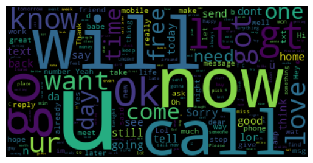

# Spam Detection Using NLP Techniques

This project implements text classification techniques to detect spam messages using Natural Language Processing (NLP) methods. It includes preprocessing steps, model training, evaluation, and performance analysis.

## Table of Contents

- [Overview](#overview)
- [Dataset](#dataset)
- [Preprocessing](#preprocessing)
- [Models Used](#models-used)
- [Evaluation Metrics](#evaluation-metrics)
- [Results](#results)
- [Usage](#usage)
- [Contributing](#contributing)
- [License](#license)

## Overview

This project aims to build a machine learning model that can classify text messages as either spam or not spam (ham). It leverages various NLP techniques such as tokenization, stopword removal, stemming, and n-grams vectorization to preprocess the text data. The model performance is evaluated using metrics like accuracy, precision, recall, and F1-score.

## Dataset

The SMS Spam Collection is a set of SMS tagged messages that have been collected for SMS Spam research. It contains one set of SMS messages in English of 5,574 messages, tagged acording being ham (legitimate) or spam. [Link to Dataset on Kaggle]([https://www.kaggle.com/datasetname](https://www.kaggle.com/datasets/uciml/sms-spam-collection-dataset))

## Preprocessing

Text preprocessing steps include:

- Lowercasing
- Punctuation removal
- Stopword removal: Common stop words are removed to reduce noise in the data.
- Stemming: Reduces words to their base or root form by removing suffixes (e.g., "running" becomes "run").
- Lemmatization: Reduces words to their base or dictionary form, considering the context (e.g., "better" becomes "good").
- Tokenization: : Splits text into individual words or tokens (e.g., "The cat sat on the mat" becomes ["The", "cat", "sat", "on", "the", "mat"]).
- N-grams vectorization (unigrams, bigrams, trigrams): N-grams refer to contiguous sequences of N items from a given text. In the context of text vectorization:

  - Unigrams: These are single words. For example, the sentence "I love machine learning" would yield unigrams: "I", "love", "machine", "learning".

  - Bigrams: These consist of pairs of adjacent words. From the same sentence, bigrams would be: "I love", "love machine", "machine learning".

  - Trigrams: These are sequences of three adjacent words. For instance, trigrams from the sentence would include: "I love machine", "love machine learning".
    
    N-grams capture sequential word information directly from text and is often used in tasks where word sequence matters, such as language modeling, sentiment analysis, and machine translation.

## Models Used

Two classification models are implemented:

1. Logistic Regression
2. Naive Bayes (Multinomial)

## Evaluation Metrics

The following metrics are used to evaluate model performance:

- Accuracy
- Precision
- Recall
- F1-score
- Confusion Matrix

## Results

| Algorithm            | Accuracy | Precision | Recall | F1-Score |
|----------------------|----------|-----------|--------|----------|
| Logistic Regression  | 97.31%   | 100%      | 79.45% | 88.55%   |
| Naive Bayes (Multinomial) | 94.98%   | 74.73%    | 93.15% | 82.93%   |

## Usage

- Modify `Spam_detection_using_text_classification.ipynb` to experiment with different preprocessing techniques or models.
- Use the provided functions and classes to integrate with other applications or pipelines.

## Contributing

Contributions are welcome! Fork the repository and create a pull request with your proposed changes.

## License

This project is licensed under the MIT License - see the LICENSE file for details.

